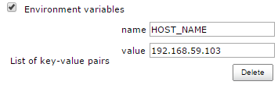
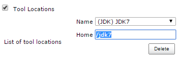
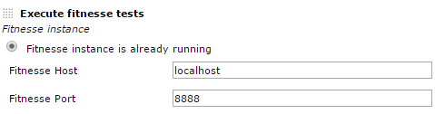
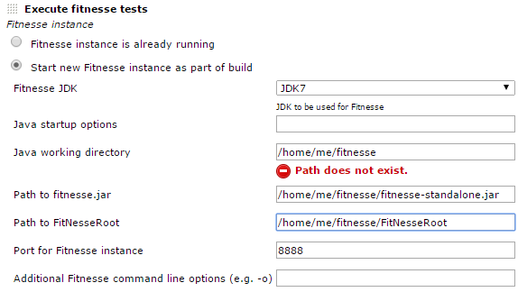
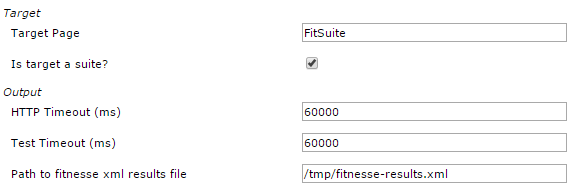
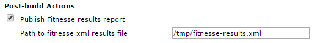
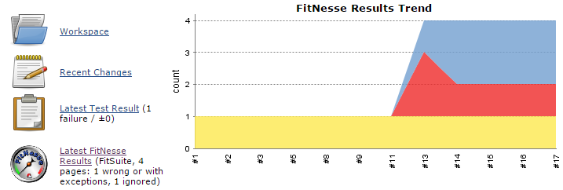
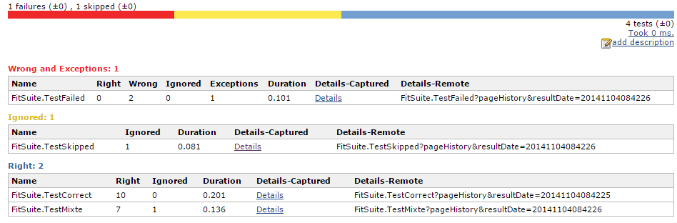
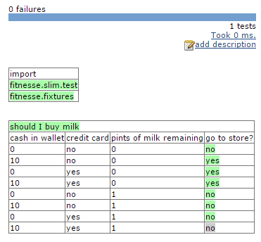

# FitNesse Plugin for Jenkins

This plugin can be used to both execute and report on [FitNesse](http://fitnesse.org/) tests so that they can be integrated
into a Jenkins build.  
Contributions are welcome, both bug fixes and new features. Just raise a pull request via GitHub.

[CI Server](https://ci.jenkins.io/job/Plugins/job/fitnesse-plugin/)

## Configuration

### **Global**

- You could define a JDK installation (not mandatory). All JDKs will
    be available in the job configuration.

### **Agent node**

- If your job runs on a remote node and launches FitNesse, you should add the
    HOST\_NAME environment variable in the node configuration and set its
    value to the node’s hostname or IP. You can name it as
    fitnesse.yourdomain.com (whatever you like). This environment variable
    will be used when you set up the fitnesse instance below (it will replace
    localhost by the content of HOST\_NAME).



Note: If you have the [EnvInject](https://plugins.jenkins.io/envinject/) plugin
    installed, Environment variables configured like in the image will not work.
    Use the EnvInject way instead. You will notice this by fitnesse still trying
    to connect to localhost, instead of the content in HOST\_NAME.


- You could also override JDK location used, by set a *Tool location*:



or by overridden JAVA\_HOME environment variable.

## Usage

### **Project settings in build step**

- **For existing FitNesse instance**: host and port where FitNesse is
    running



- **For new FitNesse instance**:
  -   **JDK**: selected JDK, JVM args and Java working directory
  -   **Paths**: fitnesse.jar and FitNesseRoot path
  -   **Fitnesse**: port use and command line args



-   **In all cases:**
    -   Target page
    -   HTTP and test timeout
    -   Results file name



#### **Project settings in post-build step**

-   Results file name: the name of the result file ; if there is several
    files, you can use wildcards.



## Result

-   On project page : a new chart with result trend and a little summary



-   All tests result in a page:



-   And finally, captured details of a test:



## Pipeline

The plugin supports pipeline the following way:

### Run your tests

With some sample values, this step looks like this:

```
step([ $class: 'FitnesseBuilder',
        options: [
        fitnessePathToRoot: "",
        additionalFitnesseOptions: "-v",  // -v for verbose
        fitnesseTestTimeout: '',
        fitnesseStart: 'true',
        fitnesseHttpTimeout: '',
        fitnesseJavaOpts: '',
        fitnessePathToJar: "/opt/var/fitnesse/lib/fitnesse-20180127-standalone.jar",
        fitnesseTargetPage: "suiteMyTestSuite",
        fitnessePartitionEnabled: 'false',
        fitnessePartitionCount: '2',
        fitnessePartitionIndex: '0',
        fitnessePartitionIndexFile: '',        
        fitnessePathToXmlResultsOut: 'fitnesse-results.xml',
        fitnessePathToJunitResultsOut: 'fitnesse-junit-results.xml',
        fitnessePortLocal: '8083',
        fitnesseJavaWorkingDirectory: "/opt/var/fitnesse/lib/"
      ]])
```


### Render results

```
step([ $class: 'FitnesseResultsRecorder',
        fitnessePathToXmlResultsIn: 'fitnesse-results.xml'
])
```

## Todo
-   Run fitnesse tests using "-c" option when starting new fitnesse
    instance
-   Add more control over fitnesse start-up params
-   Using glob to collect (potentially) multiple results.xml files
-   Nest Sub-suites and tests-within-suites within the uber-parent
    FitnesseResults instance
-   Allow direct URL access to sub-suites and tests-within-suites so
    that every level can have its history graph
-   Run multiple test suites from one project configuration

[](https://ci.jenkins.io/job/Plugins/job/fitnesse-plugin/job/master/)

## Change Log

Older versions of this plugin may not be safe to use. Please review the following changelog before using an older version:
-   **1.35** (2022-09-01)
    -   Added: Option to use [Fitnesse suite partitioning](http://fitnesse.org/FitNesse.FullReferenceGuide.UserGuide.WritingAcceptanceTests.TestSuites.SuitePartitioning)  ([PR-41](https://github.com/jenkinsci/fitnesse-plugin/pull/41))
-   **1.33** (2020-04-04)
    -   **Fixed**: [Stored XSS vulnerability](https://jenkins.io/security/advisory/2020-04-07/#SECURITY-1801)
-   **1.31** (2020-02-12)
    -   **Fixed**: [XXE vulnerability](https://jenkins.io/security/advisory/2020-02-12/#SECURITY-1751)
-   **1.30** (2019-09-19)
    -   **Fixed**: [JENKINS-58923](https://issues.jenkins-ci.org/browse/JENKINS-58923) Cannot browse result of tests when publishing several fitnesse result files on Windows
    -   **Fixed**:
        [JENKINS-58430](https://issues.jenkins-ci.org/browse/JENKINS-58430) Publishing
        two fitnesse xml files with same test name confuses the results
    -   Removed some log warnings
-   **1.29** (2019-08-11)
    -   Added: Changes
        to read and write results in distributed Jenkins
        ([PR-37](https://github.com/jenkinsci/fitnesse-plugin/pull/37))
        (Fixes:  Fitnesse should run on the agent of the build, not on
        the master node
         [JENKINS-13696](https://issues.jenkins-ci.org/browse/JENKINS-13696))
-   **1.28**(2019-01-12)
    -   Added: Produces junit report results from the fitnesse results
        ([PR-36](https://github.com/jenkinsci/fitnesse-plugin/pull/36))
-   **1.27**(2018-12-20)
    -   **Fixed:**
        FitNesse history is not rendering on builds generated by latest
        plugin versions
-   **1.25** (2018-12-05)  
    -   **Fixed:**
        FitNesse history not rendering in some cases
-   **1.24** (2018-11-08)
    -   Added:
        Support for remote FitNesse over HTTPS 
        ([PR-27](https://github.com/jenkinsci/fitnesse-plugin/pull/27))
    -   Added:
        Add environment variables support for fitnesse hostname and port
        ([PR-28](https://github.com/jenkinsci/fitnesse-plugin/pull/28))
    -   Added:
        Feature/pipeline compatibility
        ([PR-30](https://github.com/jenkinsci/fitnesse-plugin/pull/30))
    -   Improvement:
        Try to gracefully terminate the running test in case of an
        exception
        ([PR-31](https://github.com/jenkinsci/fitnesse-plugin/pull/31))
    -   Added:
        Ability to access to a protected remote Fitnesse
        ([PR-32](https://github.com/jenkinsci/fitnesse-plugin/pull/32))
    -   Fixed:
        Fixes for
        [JEP-200](https://jenkins.io/blog/2018/01/13/jep-200/) ([PR-35](https://github.com/jenkinsci/fitnesse-plugin/pull/35))
-   **1.16** (2015-06-26)
    -   Fixed FitNesse
        1.13 does not render properly FitNesse history
        ([JENKINS-29019](https://issues.jenkins-ci.org/browse/JENKINS-29019))
-   **1.15** (2015-06-22)
    -   Improvement: Add ability to define fitnesse port as enironment
        variable
        ([JENKINS-27955](https://issues.jenkins-ci.org/browse/JENKINS-27955))
    -   Fixed: FitNesse History doesn't render properly
        ([JENKINS-29019](https://issues.jenkins-ci.org/browse/JENKINS-29019))
    -   Clean code: remove useless library, remove warnings and
        deprecated methods
-   **1.14** (2015-06-21)
    -   Fixed: In result detail page, can't expand collapsed scenario
        ([JENKINS-27938](https://issues.jenkins-ci.org/browse/JENKINS-27938))
    -   Fixed: manage JDK 1.8 (increase core plugin version)
    -   Fixed: manage severals FitNesse test results in the same job
        ([JENKINS-27936](https://issues.jenkins-ci.org/browse/JENKINS-27936) -
        [pull
        request](https://github.com/jenkinsci/fitnesse-plugin/pull/25))
-   **1.13** (2015-06-02)
    -   Fixed: manage FitNesse old versions (without summary and page
        duration fields in XML result)
        ([JENKINS-28316](https://issues.jenkins-ci.org/browse/JENKINS-28316))
    -   Improve FitNesse History page: reverse column order & add sort
        on column header
    -   Fixed: use FitNesse plugin with contionnal steps(multiple)
        plugin
        ([JENKINS-21636](https://issues.jenkins-ci.org/browse/JENKINS-21636))
-   **1.12** (2015-03-31)
    -   Improve captured detail renderer (use FitNesse CSS & JS)
    -   Added: FitNesse tests history page ([pull
        request](https://github.com/jenkinsci/fitnesse-plugin/pull/23))
    -   Fixed: execution of test page ([pull
        request](https://github.com/jenkinsci/fitnesse-plugin/pull/22))
-   **1.11** (2014-11-10)
    -   Improve result table and captured detail renderer ([pull
        request](https://github.com/jenkinsci/fitnesse-plugin/pull/19))
-   **1.10** (2014-10-27)
    -   Fixed: avoid OOM on hudge result files ([pull
        request](https://github.com/jenkinsci/fitnesse-plugin/pull/16))
    -   Fixed: support Jenkins agent with a different OS than master's
        one ([pull
        request](https://github.com/jenkinsci/fitnesse-plugin/pull/18))
    -   Fixed: avoid NPE when no JDK is defined in global configuration
        ([pull
        request](https://github.com/jenkinsci/fitnesse-plugin/pull/18))
    -   Added: retrieve and display duration for all tests ([pull
        request](https://github.com/jenkinsci/fitnesse-plugin/pull/17))
    -   Fixed: test port availability to check if FitNesse is started
        instead of scraping stdout ([pull
        request](https://github.com/jenkinsci/fitnesse-plugin/pull/13))
-   **1.9** (2014-03-26)
    -   Fixed: launch FitNesse if no JDK is configured in Jenkins ([pull
        request](https://github.com/jenkinsci/fitnesse-plugin/pull/11))
    -   Improve performance on huge result file ([pull
        request](https://github.com/jenkinsci/fitnesse-plugin/pull/10))
-   **1.8** (2013-10-21)
    -   Added support for Jenkins agents ([pull
        request](https://github.com/swestcott/fitnesse-plugin/pull/8))
    -   Expose FitNesse tests results throught Jenkins API ([pull
        request](https://github.com/jenkinsci/fitnesse-plugin/pull/2))
    -   Selectable JDK for FitNesse ([pull
        request](https://github.com/jenkinsci/fitnesse-plugin/pull/3))
    -   Configuration bugfix ([pull
        request](https://github.com/jenkinsci/fitnesse-plugin/pull/4))
-   **1.7**
    -   Fixed: avoid NPE when build aborts prematurely and produces no
        results ([pull
        request](https://github.com/swestcott/fitnesse-plugin/pull/6))
    -   Use the HTTP timeout inside the connection ([pull
        request](https://github.com/jenkinsci/fitnesse-plugin/pull/1))
    -   Don't show broken image when no test results are available
        ([pull
        request](https://github.com/swestcott/fitnesse-plugin/pull/7))
-   **1.6**
    -   Added support for multiple FitNesse reports and drilling down
        into HTML output ([pull
        request](https://github.com/swestcott/fitnesse-plugin/pull/4))
-   **1.5**
    -   Report exceptions as failures
    -   Upgrade minimum Jenkins version from 1.353 to 1.401 to benefit
        from bug fixes in hudson.Proc
    -   Added support for FitNesse options -d, -r & -p.
-   **1.4**
    -   Added ability to specify path to fitnesse.jar and path to
        FitNesseRoot relative to the workspace
-   **1.3.1**
    -   Fixed bug where counts with X right and Y ignores were being
        treated as ignored not right
-   **1.3**
    -   Added ability to specify HTTP timeout (default: 60,000 ms)
    -   Added ability to specify java working directory (default:
        location of fitnesse.jar)
    -   Added page or suite name to build page summary link
-   **1.2**
    -   Added prettier tabular format for results
    -   Results file without path will be written to / read from
        workspace
    -   Log incremental console output as FitNesse results are coming in
        over HTTP
    -   Fixed: Unable to unpack fitnesse.jar
    -   Fixed: Build hangs when http get stalls
    -   Fixed: Unexpected EOF while reading http bytes
        `catch IOException`
-   **1.1**
    -   Fixed: unable to parse xml with BOM: error
        "`content is not allowed in prolog`"
-   **1.0**
    -   Brand new
